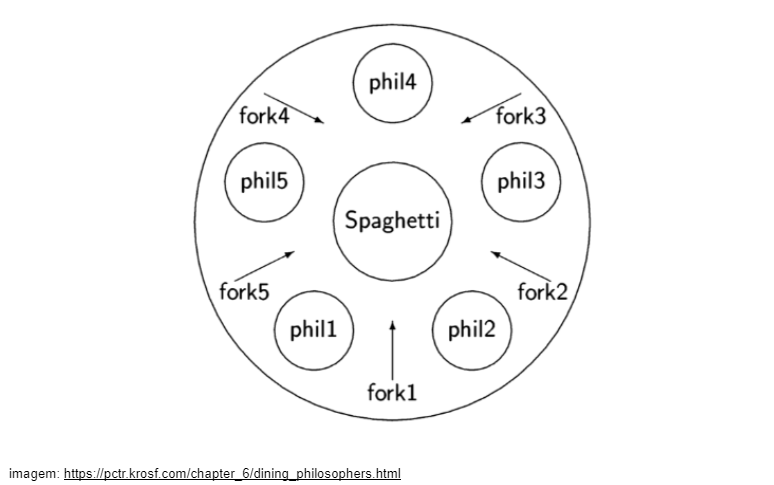

## O Jantar dos Filósofos

### O Problema

Aqui estão as coisas que precisa de saber se quiser ter sucesso nesta tarefa:
- Um ou mais filósofos se reuniram para filosofar numa mesa redonda, cada um trouxe o seu garfo.
Há uma grande tigela de esparguete no meio da mesa, mas o macarrao tem tanto molho e está tão escorregadio que só é possível comer com dois garfos. Cada filósofo pega o garfo a sua direita e o garfo a sua esquerda para comer, um em cada mão.
- Os filósofos comem, pensam, ou dormem alternadamente. E só podem fazer uma tarefa por vez, isto é, enquanto fazem uma das tarefas não podem fazer as outras duas ao mesmo tempo.

Quando um filósofo acaba de comer, volta a pôr os garfos na mesa e começar a dormir. Uma vez acordados, começam de novo a pensar. A simulação pára quando um filósofo morre de fome.

- Todos os filósofos precisam de comer e nunca devem morrer de fome.
- Os filósofos não falam uns com os outros.
- Os filósofos não sabem se outro filósofo está prestes a morrer.
- Não há necessidade de dizer que os filósofos devem evitar a morte... :)

### Processos

Um processo pode ser visto como um container de recursos utilizado por uma ou mais tarefas do sistema.

Cada processo é isolado entre si e NÃO compartilham memória. Assim possuem níveis de operação e quais chamadas do sistema podem executar. As tarefas acessam os recursos dos processos aos quais elas estão abribuídas e não podem acessar os recursos de outros processos. 

O Kernel (núcleo do sistema operacional) possuem descritores de processos PCB - proccess control block - de todos os processos ativos, e cada processo possui um PID - proccess identifier. As tarefas de um mesmo processo podem trocar infos com facilidade, já que compartilham a mesma memória. Já as tarefas de processos diferentes só podem se comunicar por ipc, pelo kernel, inter-proccess-comunication.

Um processo é composto por diversas THREADS.
Uma thread é uma linha de execussão dentro de um processo. Cada thread tem seu próprio estado de processamento e sua própria pilha, mas compartilham memória com as treads irmãs, filhas de um mesmo processo. As threads são linhas de execussões de um processo que podem rodar concomitantemente.

PROBLEMAS: 

    Deadlock - bloqueio - quando 2 processos tentam acessar o mesmo recurso... um processo acaba bloqueando o outro, ou seja, um processo tem que esperar o outro acabar para poder acessar aquele recurso. Impede a execussão dos comandos e a fluidez do sistema.

    STARVATION - uma thread nunca é executada pois espera a resposta de outra, que morreu ou está bloqueada - virando uma thread zumbi. 

Soluções:

    Ativar e desativar as interrupções. Um processo ativa interrupções ao entrar em uma zona crítica e as desativa quando sair dela.

    Variáveis de bloqueio - var = 1 (região de bloqueio está ocupada) e var = 0 (região de bloqueio não está ocupada).

    Alternância estrita - turn = 1 ; processo A executa o que precisa depois faz turn = 0; qnd turn = 0 processo B comeca a execussão, e assim vão alternando.

A interação e execussão podem ser manipuladas por Paralelismo e Concorrência aumentando o desempenho do programa, aumentando a quantidade de tarefas que podem ser executadas num período de tempo.

### Estrutura

Cada Filósofo representa uma thread e cada garfo é um semáforo;
Pegar o garfo - aciona a operação wait no semárofo, e quando larga, aciona o signal nesse mesmo semáforo.

Os semáforos controlam o acesso aos recursos compartilhados em um ambiente multitarefas.
Semáforos:  - inicialização
            - operação wait
            - operação signal
Enquanto um processo estiver realizando operações em um semáforo, nenhum outro pode realizar, devendo esperar que o primeiro encerre ela.

Um semáforo binário, ou princípio de exculsão mútua, é um MUTEX, podendo assumir o valor de wait = 0, ou de signal = 1. É usado em programação concorrente, para evitar que dois processos ou threads tenham acesso simultâneo a um recurso partilhado.

### Exigências
- O(s) seu(s) programa(s) deverá(ão) aceitar os seguintes argumentos:
número_de_filósofos tempo_até_morrer_de fome tempo_da_refeição tempo_de_dormir e (número_de_refeições_por_filo - ARG OPICIONAL)
◦ O número de filósofos e também o número de garfos.
◦ tempo_até_morrer_de fome (em milisegundos): Se um filósofo não começar a comer tempo_até_morrer_de fome desde o início da sua última refeição ou do início da simulação, ele morre.
◦ tempo_da_refeição (em milissegundos): O tempo que um filósofo demora a comer. Durante esse tempo, eles terão de segurar dois garfos.
◦ time_to_sleep (em milissegundos): O tempo que um filósofo vai passar a dormir.
◦ número_de_refeições_por_filo (argumento opcional): Se todos os filósofos comeram pelo menos o úmero_de_refeições_por_filo vezes, a simulação pára. E se não for especificada, a simulação pára quando um
morre o filósofo.
- Cada filósofo tem um número que varia de 1 ao número_de_filósofos.
- É uma mesa circular filósofo número 1 senta-se, e ao lado dele senta-se o 2... assim vai até que o último filósofo senta-se ao lado do filo1.

Seu programa deve retornar no terminal qualquer mudança no estado dos filósofos:
◦ time_in_ms X pegou um garfo
◦ time_in_ms X está comendo
◦ time_in_ms X está dormindo
◦ time_in_ms X está pensando
◦ time_in_ms X morreu
Substituir o X pelo número do filósofo.
- Uma mensagem de estado apresentada não deve ser misturada com outra mensagem.
- Uma mensagem anunciando a morte de um filósofo não deve ser exibida mais do que 10 ms
após a morte efectiva do filósofo.
- Mais uma vez, os filósofos devem evitar a morte!

## Resolução:

Este projeto é sobre a *programação simultânea* que permite que um programa execute várias tarefas simultaneamente em vez de ter que esperar que o resultado de uma operação passe para a próxima (o sistema operacional funciona assim).

Existem três maneiras de implementar a simultaneidade em nossos programas: *threads, processos e multiplexação*. Vamos nos concentrar em tópicos.

### Thread (mandatório)

Thread: Uma thread de execução é uma sequência lógica de instruções dentro de UM processo que é gerenciado  automaticamente pelo kernel do sistema operacional. Um programa sequencial regular tem uma única thread, mas os sistemas operacionais modernos nos permitem criar várias threads em nossos programas, todas executadas em paralelo.

Uma thread é uma linha de execussão dentro de um processo. Cada thread tem seu próprio estado de processamento e sua própria pilha, mas compartilham memória com as treads irmãs, filhas de um mesmo processo. As threads são linhas de execussões de um processo que podem rodar concomitantemente.

As threads são menos custosas que os processos, e não possuem a hierarquia "pai-filho",  e como elas atuam sobre uma mesma área da memória são mais ágeis do que vários processos conversando.

### Processos (bônus)

Em programação, um processo é uma instância de um programa em execução em um sistema operacional. Cada processo tem sua própria memória e espaço de endereçamento, e é geralmente executado em seu próprio ambiente isolado. Os processos geralmente interagem com outros processos através de mecanismos definidos pelo sistema operacional, como sinais, pipes e sockets. Nos sistemas operacionais tais como Windows e Linux muitos dos seus recursos operam sobre a forma de processos.

A função fork() é um system call capaz de criar um novo processo denominado filho, que é uma cópia exata do processo original denominado pai, e é uma técnica para poder dividir o trabalho. O fluxo é ramificado após a execução do fork, e é possível distiguir qual processo é qual pelo PID retornado a função fork. O processo filho tem o PID = 0, já o processo pai tem o PID = int < 0 (qualquer int maior que zero).

Quando o sistema operacional lança um processo, esse processo tem uma memória reservada para poder realizar a sua execução, ou seja, sua memória fica protegida somente para o seu uso, e para se comunicar com outros processos é necessário algum mecanismo que permita essa comunicação ou alguma outra forma que os dados sejam compartilhados entre os processos, é nesse momento que entra em cena o IPC.

### Comparando Threads e Processos

Multiprocessos e multithreads são duas abordagens diferentes para a execução concorrente de tarefas em um sistema computacional. A principal diferença entre eles é que os multiprocessos envolvem a criação de múltiplos processos independentes, enquanto os multithreads envolvem a criação de múltiplos threads dentro de um único processo.

Em um sistema multithread, várias threads são criadas dentro de um único processo, compartilhando o mesmo espaço de endereçamento e dados. Cada thread executa uma tarefa específica, mas todas têm acesso aos mesmos recursos do processo. As threads podem ser gerenciadss pelo próprio programa, sem intervenção do sistema operacional. A comunicação entre as threads pode ser feita através de variáveis compartilhadas ou objetos de sincronização, como mutexes e semáforos.

Em um sistema multiprocessado, vários processos são executados simultaneamente, cada um com sua própria cópia de dados e código. Cada processo é gerenciado pelo sistema operacional, que garante que cada um tenha acesso justo aos recursos do sistema, como CPU, memória e dispositivos de entrada/saída. A comunicação entre processos pode ser feita através de mecanismos definidos pelo sistema operacional, como pipes, sockets, sinais ou memória compartilhada.

A escolha entre a abordagem multiprocessos e multithreads depende das necessidades do aplicativo em questão. Em geral, os multiprocessos são mais seguros e estáveis, pois um processo não afeta o estado de outros processos, enquanto os multithreads podem ser mais eficientes e escaláveis, pois não há o custo de criar e gerenciar processos adicionais.

### Multiplexação (conteúdo além do que precisamos para esse projeto)

>Multiplexação é uma técnica que permite que múltiplos sinais ou fluxos de dados sejam transmitidos através de um único canal de comunicação, maximizando o uso do canal e economizando recursos de rede.
>Existem vários tipos de multiplexação, incluindo a multiplexação por divisão de tempo (TDM), multiplexação por divisão de frequência (FDM), multiplexação por divisão de comprimento de onda (WDM) e a multiplexação por divisão de código (CDM). Cada técnica de multiplexação tem suas próprias vantagens e desvantagens e é mais adequada para diferentes aplicações e cenários.

### Data-racing (problema que deve ser evitado)

Data racing (ou race condition) é um problema que pode ocorrer quando duas ou mais threads ou processos acessam uma mesma variável compartilhada ou recurso de forma concorrente e sem a devida sincronização. Quando isso acontece, o resultado final da operação pode ser inconsistente ou imprevisível, já que a ordem de execução das operações não é garantida.

Para evitar data racing em threads e processos, é necessário garantir que as operações concorrentes sejam executadas de forma ordenada e segura. Isso pode ser feito através do uso de mecanismos de sincronização, como mutexes, semáforos, monitores, entre outros. Além disso, é importante garantir que as operações em recursos compartilhados sejam atômicas, ou seja, que não possam ser interrompidas ou executadas de forma parcial por outras threads ou processos.

### Semáforos

Semáforos são um mecanismo de sincronização comumente usado em programação concorrente e multithreaded para controlar o acesso a recursos compartilhados.
Um semáforo é um objeto que possui um valor inteiro não negativo (chamado de contador de semáforo) e duas operações principais: wait (ou down) e signal (ou up). Quando uma thread ou processo deseja acessar um recurso compartilhado, ela primeiro deve chamar a operação wait no semáforo. Se o valor do contador de semáforo for maior que zero, o semáforo é decrementado e a thread ou processo continua sua execução. Se o valor do contador for zero, a thread ou processo é bloqueado até que outro processo chame a operação signal no semáforo, incrementando o contador e permitindo que a thread ou processo bloqueado continue. 

A operação signal no semáforo é usada para sinalizar que um recurso compartilhado está disponível para ser usado. Quando um processo ou thread libera o recurso, ele chama a operação signal no semáforo correspondente, incrementando o contador de semáforo e permitindo que outros processos ou threads que estejam esperando tenham acesso ao recurso.

Semáforos são úteis para evitar condições de corrida (race conditions), garantindo que apenas um processo ou thread tenha acesso a um recurso compartilhado em um determinado momento. Além disso, eles podem ser usados para sincronizar threads e processos, garantindo que certas operações sejam realizadas em uma ordem específica.

### Mutex

O mutex é um tipo específico de semáforo, utilizado para garantir exclusão mútua (mutual exclusion) em regiões críticas de um programa. Enquanto os semáforos podem ser usados para controlar o acesso a recursos compartilhados entre vários processos ou threads, os mutexes são utilizados para sincronizar o acesso a recursos compartilhados dentro de um mesmo processo ou thread.

O mutex é um semáforo binário, ou seja, ele pode ter apenas dois valores possíveis: bloqueado (ou ocupado) e desbloqueado (ou livre). Quando um processo ou thread deseja acessar uma região crítica do código, ela deve primeiro adquirir o mutex associado a esse recurso. Se o mutex estiver disponível, a thread pode adquiri-lo e acessar o recurso compartilhado. Se o mutex já estiver em uso por outro thread, o thread atual será bloqueado até que o mutex esteja disponível novamente. E enquanto uam thread possui o mutex, nenhuma outra thread pode adquiri-lo, garantindo assim que o recurso compartilhado esteja sendo acessado por apenas uma thread por vez. Quando a thread atual terminar de usar o recurso compartilhado, ela deve liberar o mutex usando a função correspondente.

Os mutexes são importantes para evitar condições de corrida (Data racing) e inconsistências de dados em programas multithread. Eles também são usados em sistemas operacionais para controlar o acesso a recursos de hardware compartilhados, como impressoras e dispositivos de armazenamento.

#### Referências:

https://embarcados.com.br/fork-exec-e-daemon/
https://www.youtube.com/watch?v=G0ZCndqb0xk
https://www.codequoi.com/en/threads-mutexes-and-concurrent-programming-in-c/
